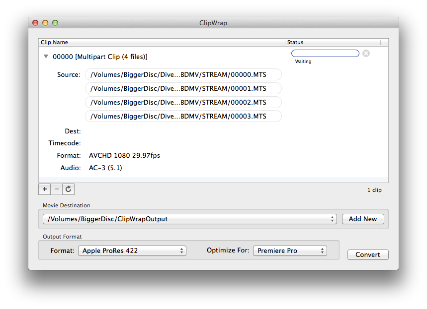
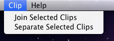
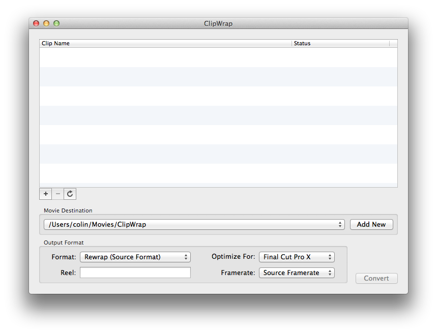

# Welcome to ClipWrap 2 #


##Welcome##


ClipWrap is a Mac application designed to make HDV and AVCHD files a first class citizen in your QuickTime ecosystem.  


This manual will walk you through the basics of using ClipWrap as part of your post production workflow.

For the latest updates, news and support, be sure to visit [http://www.divergentmedia.com/clipwrap](http://www.divergentmedia.com/clipwrap).


##Overview##

Modern file-based cameras record to a variety of types of media (SD cards, Harddisk, Compact Flash, etc) in two primary formats, MTS and M2T. These files, called transport files, are ideal for this type of recording, but they're not ideal for post production, particularly on the Macintosh.


ClipWrap bridges the gap, giving you the flexibility to design the workflow that works best for you.


#Getting Started#


##Installing##

ClipWrap is a self-contained application for Intel Macs. Just drag and drop ClipWrap to your Applications folder and you're ready to start using it.


Some transcode options may require additional software to be installed. Codecs such as Apple's ProRes or Avid's DNxHD are installed by third party applications or installers. See Chapter 5 for more information.


##Uninstalling##

If you want to uninstall ClipWrap, simply drag the application to the trash.


ClipWrap stores its preferences in a file named `com.divergentmedia.clipwrap.plist` in your ~/Library/Preferences/ folder.


##Registering##

When you first launch ClipWrap, it will run in trial mode, which will only rewrap or transcode the first minute of each clip. To lift this restriction, you must purchase a serial number and enter it in the Registration dialog.


Serial numbers can be purchased directly from divergent media by visiting our web store at

<https://store.divergentmedia.com>.  You can also purchase via the Mac App Store.

If you've already purchased ClipWrap, click the "Enter Key" button and enter your name and key exactly as it is shown in your registration information. You may display this menu at any time by selecting "Registration" from the ClipWrap menu.


##Updating##

ClipWrap automatically checks for updates during startup. If you'd like to force it to check for an update, select "Check for Updates" from the ClipWrap menu.


## Reinstalling ##


If you've purchased from our website, you can download a "fresh" copy at any time from <http://www.divergentmedia.com/filedownload/clipwrap>.  After downloading, you can unlock it with your key.  If you've lost your key, you can look it up at <http://www.divergentmedia.com/divergent/keylookup>.


#Application Overview#

ClipWrap accepts files in the .mts, .m2t and .m2ts format, and converts them to a variety of QuickTime compatible formats.




Once files have been converted with ClipWrap, they can be opened by any application that accepts QuickTime files. ClipWrap is a one-way process - it won't convert QuickTime files back to .mts or .m2t.


##Basic Usage##

To add clips to ClipWrap, you can simply drag and drop files from Finder. Alternatively, you can click the "plus" icon in the ClipWrap interface and browse to your media, or select "Open" from the "File" menu. If the file is a type that ClipWrap understands, it will quickly analyze the file to gather some metadata information. You can display this information by clicking the triangle to the left of the file name.

The bottom of the ClipWrap window allows you to set destinations for your media, and to choose between "Rewrap" or "Transcode" modes. ClipWrap remembers the last five locations you've used, so you can quickly jump between destinations for different projects.  You can also tell ClipWrap to optimize your files for the editing application you'll be using - when in doubt, leave the setting on "General."

Once you've chosen all of your settings, click the "Convert" button and just sit back and relax.


##Rewrap##

M2T and MTS files aren't directly playable on the Macintosh. But those files actually contain media that your Mac knows how to play - MPEG-2 and H.264 video, respectively. ClipWrap unlocks that content by rewrapping your media into standard QuickTime files.

During a rewrap, the video data within your files (called "samples") is left untouched. It's merely copied and restructured into a format that QuickTime can understand.

By default, the audio tracks are decompressed and saved as raw linear PCM (LPCM), the most universal format of audio. You may turn off this decompression by unchecking the "Convert Audio to LPCM" box in the [preferences](#preferences). We don't recommend doing this unless you're certain your workflow supports it. See [chapter 4](#choosing-a-workflow) for more details about this setting.


##Transcode##

The second mode that ClipWrap can operate in is Transcode. In this mode, ClipWrap decompresses your video samples, and recompresses them into industry standard post production formats like Apple intermediate, Avid DNxHD or Apple ProRes.

Transcode mode allows you to integrate content into existing post-production workflows, and to take advantage of all of the optimizations built into modern editing applications like iMovie, Avid Media Composer and Apple Final Cut Pro.

**When transcoding, ClipWrap uses the encoders that are already installed on your computer.** See [the troubleshooting section](#troubleshooting) for more details about codec availability.


##Spanned Clips##

Many devices are limited to recording files in 2 gigabyte chunks, due to filesystem limitations. To get around this limitation, these devices record media across multiple files. These files need to be rejoined during a rewrap or transcode to ensure glitch-free playback.




###HDV###

HDV cameras and recording devices generally signify spanned files via file naming. When you add the first file from a spanned HDV sequence, ClipWrap automatically scans for additional clips in the sequence, and if possible, adds them into a single composition.


###AVCHD###

AVCHD cameras store each clip numbered sequentially, and separate metadata that denotes which files should be rejoined later. If you're working with an AVCHD camera, and have the complete folder hierarchy ("BDMV," etc) you can drag the folder structure to ClipWrap. ClipWrap will parse the metadata from the camera to determine clip spanning.


##Manually Spanning##

There may be times when ClipWrap can't automatically detect the clips in a sequence. Often this happens when files have been renamed or moved, or if a camera is using a non-standard naming scheme.  **Only join clips that were split during recording.**  If you join other clips, you'll likely encounter sync issues or visual glitches.  For joining discrete clips, we recommend using [Add Movie](https://itunes.apple.com/us/app/addmovie/id426306166?mt=12) after converting your files with ClipWrap.


In these cases, you can manually span clips. You can select "Open Multiple" from the "File" menu to join a set of clips. Alternatively, you can add all of your clips to the ClipWrap window. Select the first clip in the sequence, then hold down the shift key and click the last key in the sequence.  


Select "Clip" from the menubar, and click "join clips." This will build a multiclip composition.





###Splitting Spanned Groups###

In rare cases, ClipWrap may incorrectly identify clips as spanned, even when they shouldn't be. To correct this, simply highlight the clip, then select the "Clip" menu and click "Separate Selected Clips."


###Rearranging Clips in a Spanned Group###

You can manually rearrange clips in a group. Click the triangle to the left of the composition to reveal all of the clips. Click and drag the individual clips to rearrange them.  


##File Naming##

ClipWrap maps input filenames directly to the output. So, a clip labeled "00000.mts" will become "00000.mov." When dealing with spans, output clips will take the name of the first file in the span.  If you set a reel name, it will be prepended to the file name.

If there are multiple files in a batch with the same name, they will overwrite each other. When processing multiple cards in a single batch, you may need to rename the source files before bringing them in to ClipWrap. Alternatively, you can convert multiple batches simultaneously, with different destinations, by opening additional ClipWrap windows. To open additional windows, use the "New Window" option under the "File" menu.


##Optimize Output##

If you know that your workflow will be primarily based in a particular application (Final Cut Pro X, Premiere Pro, etc), you can use the "Optimize Output" dropdown to create files tailored for that application. By targeting a specific application, ClipWrap can create files that will perform better and more consistently.

If you aren't sure which application you'll be using, or need to move between multiple applications, leave the dropdown set to "General."


##Advanced Options##

You can enable some advanced options within the [ClipWrap Preferences](#Preferences).  Once enabled, the ClipWrap window will give you the ability to set a Reel name, and to adjust the framerate of your output.





###Reel Name###

The reel name is a text field which will be added to the filename of your converted files, and will be embedded in the file's metadata.  The reel will then be available within Final Cut Pro and other apps that conform to the QuickTime reel specification.


###Adjust Framerate###

The framerate adjustment drop down allows you to override the framerate of your output.  This is most commonly used for producing a "slow motion" effect with 50p or 60p content.  


#Choosing a Workflow#

While every situation is different, we can offer some general advice for choosing a workflow when using ClipWrap.


##HDV##

If you're working with HDV (.m2t) media and planning to edit in Final Cut Pro, the "rewrap" workflow is usually the best choice. The resulting file is similar to what Final Cut Pro produces when capturing HDV material from tape.

In general, we would only recommend transcoding HDV material when it is explicitly called for. For example, if you need to introduce HDV material into a ProRes-native timeline, you may want to transcode to ProRes, rather than dealing with rendering in Final Cut Pro.

When working with Final Cut Express, we recommend transcoding to Apple Intermediate Codec.  Final Cut Express does not support most other formats.


##AVCHD##

AVCHD (.mts/.m2ts) is the modern standard for low- to mid- range HD media production. It is able to achieve amazing quality at very low data-rates by leveraging advanced video compression. The downside of this video compression scheme is that it's highly CPU intensive.

If you just need to make your AVCHD into a universally viewable QuickTime file, the "rewrap" option is fine. For example, this is a good choice for viewing dailies, or passing content onto a producer for review. This is also a good choice for integrating your files into an existing QuickTime-centric transcoding workflow.

Due to the CPU-intensive nature of the format, we generally recommend transcoding AVCHD to another format for editing. If you'll be editing in Final Cut Pro 7, we recommend Apple ProRes. For Avid, we recommend DNxHD. For iMovie we recommend Apple Intermediate.  If you're using a fast Mac and editing in Final Cut Pro X or Adobe Premiere Pro (6 or better), the rewrap option is fine.

While you can add rewrapped AVCHD material to a Final Cut Pro timeline, performance is likely to suffer, particularly for anything more than a straight-cuts edit.


#Preferences#

Preferences can be accessed by selecting "Preferences" from the "ClipWrap" menu, or by pressing command-, on your keyboard.


##General Preferences##

The "General" tab has three checkboxes for controlling functionality in ClipWrap. The first option, "Check for Updates at Startup" option allows you to enable or disable automatic update checks.


###Preserve Source File Creation Time###

When this option is enabled, files created by ClipWrap will be given creation and modification times that match the source file (the MTS or M2T file from your camera). This means that when importing into a program like Aperture or Final Cut Pro X, your files will be organized according to the original creation time.


###Show Advanced Settings###

This setting reveal some additional options within the ClipWrap window.  You'll be able to adjust the framerate of your converted files, and set a reel name.


###Show Codec Conflict Alert###

By default, ClipWrap will warn you if you have codecs installed on your system which are known to cause conflicts or instability.  If you'd like to suppress these alerts, you can check this box.  Please note that this **may impact stability.**


###Open Converted Files In###

This option allows you to assign an application that will be opened after each rewrap or transcode is completed. The list is prepopulated with common choices, but you may select any application capable of opening QuickTime files by choosing the "Other ..." option in the dropdown.

Media 100 users will notice that Media 100 overrides the application selection, though the feature may still be disabled altogether.


##Audio Preferences##


###Convert Audio to LPCM###

ClipWrap provides two options for dealing with the audio in your media. AVCHD cameras generally record in a format called AC3, in either stereo or 5.1 surround sound. Editing applications generally work better with uncompressed "raw" audio, in a format called LPCM.

For most users, we recommend leaving the "Convert Audio to LPCM" box checked. If you know that you'll be playing your media on a device that handles AC3 decoding (like a surround sound receiver), you can uncheck that box to maintain the audio format.

Converting Audio to LPCM will result in larger files than your source media.


###Audio Mixdown Settings###

By default, ClipWrap will convert AC-3 5.1 channel surround sound audio into 6 discrete channels of audio. This allows you to have complete control over your audio layout. However, if you are editing in an older application, or are mixing 5.1 audio with more traditional stereo audio, you may wish to convert your 5.1 audio to 2 channel stereo.

On most computers, you may adjust this "mixdown" setting within the ClipWrap preferences. However, if you have the Perian QuickTime plugin installed, you will need to adjust the setting within the Perian preferences. ClipWrap will alert you if this is the case. Within the Perian preferences, you can toggle between "stereo" and "multichannel" output (ignore the other settings).


#Troubleshooting#

We strive to make ClipWrap as easy to use and as reliable as possible. However, there may be situations in which you experience a crash or a failed conversion. We're always happy to support you via our support address, <support@divergentmedia.com>, but the tips below resolve most issues.


##Codec Availability##

ClipWrap leverages the video codecs that are already installed on your system for transcoding. This means that you will only be able to select the formats that have been previously installed on your system. ClipWrap checks you system on launch to determine which codecs you have installed, and disables any unavailable items in the format dropdown.

In general, Apple's ProRes family of codecs are only available on systems with Final Cut Studio, Final Cut Pro X, Compressor or other Apple Pro-Apps installed.  The trial version of Final Cut Pro X also includes ProRes.  If you have Final Cut Pro X installed and do not see the ProRes option in ClipWrap, launch Final Cut Pro X and select "download additional software" from the Final Cut Pro X menu.

Avid's DNxHD codec is available as part of the Media Composer installation, or as a download from [http://www.avid.com/dnxhd](http://www.avid.com/dnxhd).

The Apple Intermediate Codec (AIC) is available if you have Final Cut Studio or iMovie installed, and so should be available on the vast majority of Macs. 


##Confirm your target drive is writable##

Mac OS X cannot natively write files to NTFS formatted harddrives.

If you select an NTFS formatted drive as your output destination, your clip will fail to convert. This can occur if a Windows user has provided a harddisk with media.

You may also encounter issues when writing to FAT32 formatted drives. This is typically the format for external harddisk, unless they've been reformatted for the Macintosh. The FAT32 filesystem is limited to 2 gigabyte files, and transcoded files often exceed that size.

Other drives (network shares, etc) may experience similar issues. When in doubt, select your Desktop as the destination to confirm that there isn't a writeability issue.


##Check for conflicting codecs##

Media Producers often have a wide range of software installed on their computers. Occasionally, this software will conflict with ClipWrap.  In particular, there are a handful of QuickTime plugins which we've identified as potential issues.



ClipWrap will alert you if you've got codecs that are known to cause problems.  If you'd like to check yourself, you can use the information below.


* EyeTV MPEG Support.component 

* Perian.component

* A52.component 

* AC3Codec.component


They may be found in any of the following locations on your computer:


* /Library/QuickTime

* /Library/Audio/Components/Plug-Ins

* /Users/(your username)/Library/QuickTime

* /Users/(your username)/Audio/Components/Plug-Ins


To test whether these files are causing your issue, drag them to the desktop, then relaunch ClipWrap and try your conversion again.


##Tips for Contacting Support##

When contacting support, there are a few bits of information you can provide that will speed the support process.

Tell us the type of computer you're using, the version of OS X, and the version of ClipWrap. Also let us know what type of camera your media came from, being as specific as possible. Tell us whether the problem occurs when transcoding, rewrapping, or both.

If you've experienced a crash, you can submit a crash report the next time you launch ClipWrap.  Please include your email address when submitting the crash report so we can follow up with you.


#Command Line Interface#

ClipWrap provides a command line interface which can be used to automate the rewrap process. **Please note, the command line interface is not available in copies of ClipWrap purchased from the Mac App Store. Email support@divergentmedia.com for a command-line capable version if you purchased via the App Store.**

The command line interface accepts the following input:


```

./ClipWrap -action <action> (-convertAudio yes/no) (-optimizeOutput <destApp>) (-reel <reelname>)   

(-adjustFramerate <framerate>) -srcFile <Source File> -dstFile <Destination File>


Optimize Output Options:

	general

	imovie

	premiere

	fcpx

	fcp7


Actions:

	wrap (default)

	prores422sq

	prores422hq

	prores4444

	proresproxy

	proreslt

	dnxhd36

	dnxhd145

	dnxhd220

	dv

	hdv

	dvcprohd

	aic

	xdcamex

	xdcamhd


Framerate should be one of:

	f239

	f24p

	f25p

	f30i

	f30p

	f50p

	f60p

```

	

You can use "./ClipWrap -help" to get a full list of available commands.



#Other Resources#


If you need additional support using ClipWrap, please try the resources listed below.


##Support on the Web##


<http://www.divergentmedia.com/support>


##Email support##

<support@divergentmedia.com>



