# Welcome to EditReady #

## Welcome ##

EditReady provides easy, powerful, and fast transcoding for video professionals.

This manual will introduce you to the basics of EditReady, and provide suggestions for ways to use it within your post-production workflow.

For news, updates, and support regarding EditReady, or to learn about other products from Divergent Media, visit [http://www.divergentmedia.com](http://www.divergentmedia.com).

## Overview ##

Modern production pipelines often involve generating a wide mix of QuickTime, MXF, AVCHD, and HDV files.  A single production may use a mix of "A-Camera" files in ProRes422, "B-Camera" footage in H.264, as well as archive footage in formats like Apple Intermediate Codec.

EditReady lets you take this mix of files and convert them into a single mezzanine format, offering your post-production pipeline simplicity, reliability, and performance.

EditReady can also generate high quality proxy media, so that you can take all of your media with you on the road.

# Getting Started #

## Installing ##

EditReady is available as a direct download from [http://www.divergentmedia.com](http://www.divergentmedia.com).  After you've downloaded it from our website, just drag and drop the application into your Applications folder.

In order to convert footage to or from the Avid DNxHD Codec, you'll need to have the free DNxHD plugin installed.  It can be downloaded from [http://www.avid.com/dnxhd/](http://www.avid.com/dnxhd/).

## Uninstalling ##

To remove EditReady, simply drag it to your trash.

## Registering ##
When you first launch EditReady, it will run in trial mode, which will only transcode the first minute of each clip. To lift this restriction, you must purchase an unlock key from <http://store.divergentmedia.com>.

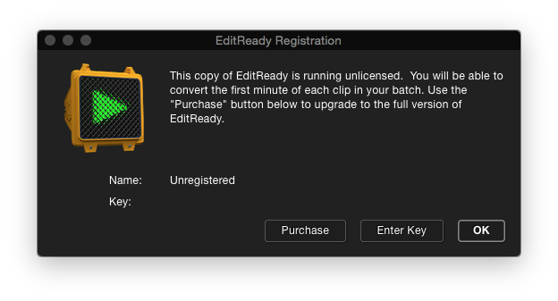
If you've already purchased EditReady, click the "Enter Key" button and enter your name and key exactly as it is shown in your registration information. You may display this menu at any time by selecting "Registration" from the EditReady menu.

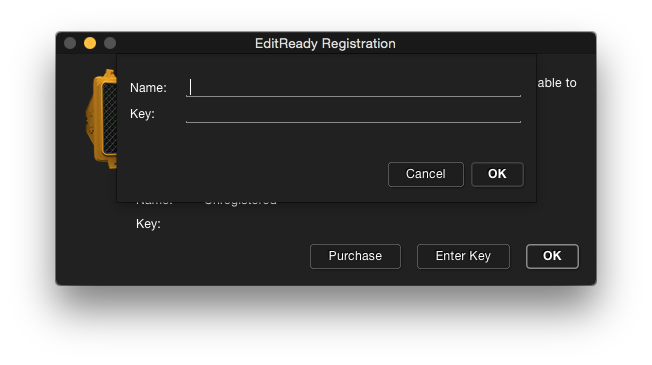

## Updating ##
EditReady automatically checks for updates during startup. If you'd like to force it to check for an update, select "Check for Updates" from the EditReady menu.

## Reinstalling ##

If you've purchased from our website, you can download a "fresh" copy at any time from <http://www.divergentmedia.com/filedownload/editready>.  After downloading, you can unlock it with your key.  If you've lost your key, you can look it up at <http://www.divergentmedia.com>.

# Application Overview #

EditReady accepts files in the QuickTime MOV, MP4 and M4V formats, as well as MXF files from most cameras that record to the MXF format.  In addition, it supports files in the AVCHD and HDV formats, which generally use the M2T, MTS and M2TS extensions.  In general, if a file plays in QuickTime Player (for MOV/MP4/M4V files) or VLC (for MXF, M2T and MTS files), it'll play in EditReady.

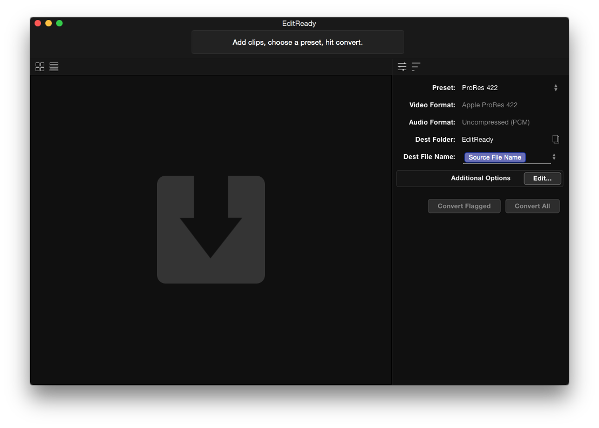

While you can customize many parts of the conversion process, EditReady includes a variety of presets so you can get started right away.

## Basic Usage ##

Clips can be added to EditReady by selecting "Open" under the "File" menu, or by dragging clips into the EditReady window.  Your clips will appear with thumbnails in the EditReady window.  You may toggle between "list view" and "thumbnail" view using the selector in the toolbar.

If you'd like to convert all of your clips, simply click the "convert all" button on the right.  If you'd only like to convert some clips, you can select them by clicking the "flag" icon (or selecting "Flag Clip" from the Clip menu).  Then click "Convert Flagged."

EditReady includes a variety of presets for popular editing formats like ProRes and DNxHD.  You can customize these further by creating [custom presets](#custom-presets).

Regardless of the preset you select, you have the option of adjusting the destination folder and destination file name.  See ["Naming your Files"](#naming-your-files) for details.

## Multiple Windows ##

You can open multiple windows by selecting "New Window" from the File menu.  This allows you to easily queue different batches, with different settings.

## Monitoring Progress ##

After starting a batch, the sidebar will toggle to the progress tab, which will show you progress information for each clip.  The top of the EditReady window will show you progress information for the overall batch (or batches).

# Previewing Files #

EditReady allows you to preview your files before conversion.  To access the player, select the clip and choose "Open Preview" from the Clip menu, or press command-3 on the keyboard.

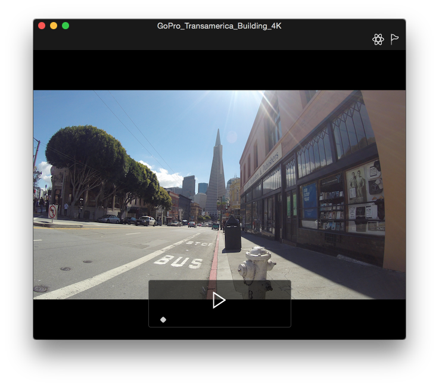

## Applying LUTs during Playback ##
Click the "Add LUT" icon to apply a LUT to your file during playback.  This allows you to quickly preview any conversions you'd like to apply.  For details on LUT support in EditReady, see the [LUTs](#luts) chapter.

Keep in mind that LUTs can be compute-intensive, particularly on 4K files.  Slower computers (or computers with slower graphics cards) may have trouble with realtime playback.

# Metadata #

One of the most powerful features in EditReady is the ability to view and edit the metadata contained in your files.  You can access metadata for a clip by selecting the clip and then choosing "Edit Metadata" from the "Clip" menu, or by pressing command-2 on your keyboard.

## Browsing Metadata ##

Metadata may include camera settings like F-Stop, Iris, and Shutter, as well as items like Location (if your camera has GPS), media serial numbers, or even diagnostic data.

In some cases, there may be multiple entries for a single category of metadata.  For example, your camera may store a "Creation date" in a variety of places throughout the file.  If the values within the key don't match, EditReady will display "Conflicting Values" and provide a disclosure triangle to reveal the individual entries.  If you'd like to unify all of these entries with a single value, click the checkbox to the right of the value you'd like to preserve.  Any other value will be replaced.

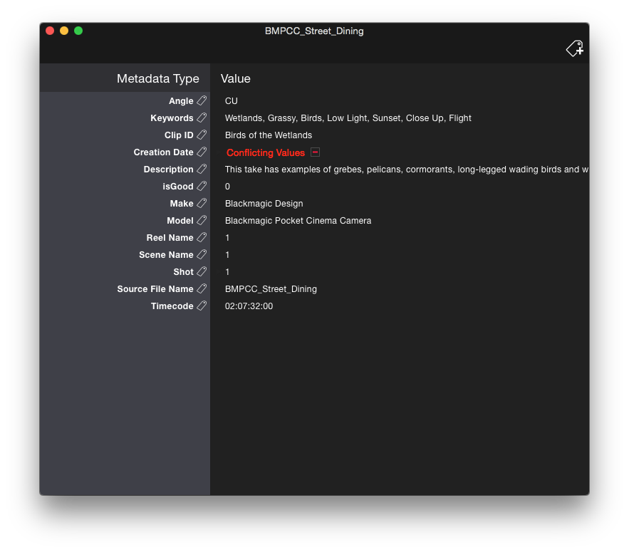

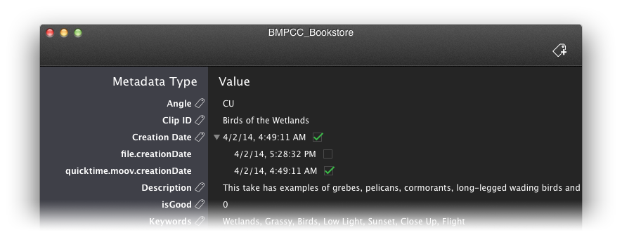

\break

If your camera includes GPS data in the metadata, those fields will have a "pin" icon, allowing you to view the clip location on a map.

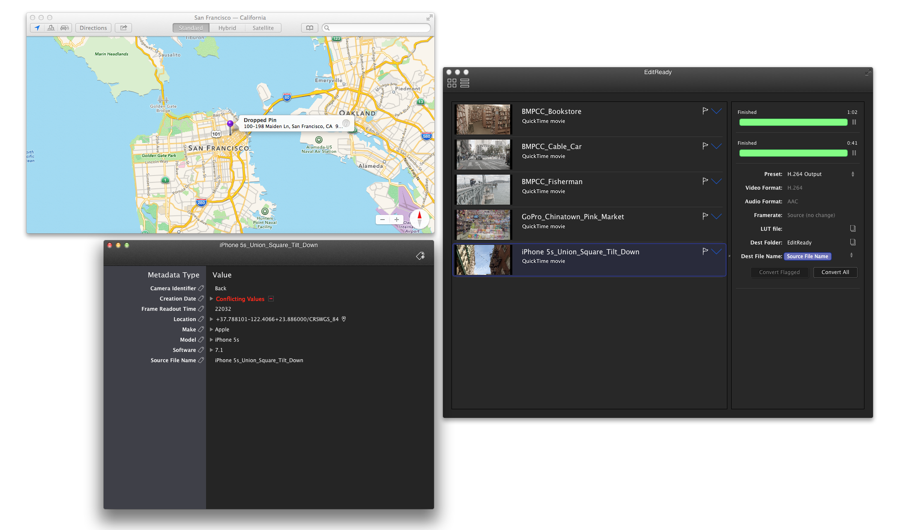

Some metadata is intended only for use by the camera manufacturer during troubleshooting, so may appear as simply a string of numbers or letters within EditReady.

## Editing Metadata ##

To edit an entry, simply double click and begin typing.  Depending on the field, EditReady may enforce requirements on the type of information you can enter (for example, date fields may only contain a valid date).

## Adding Metadata ##

To add a new entry click the "add metadata" icon in the upper right corner of the Metadata window.  You'll be able to select from a variety of categories and metadata keys.  If you'd like to customize this selection, see [appendix a](#appendix-a).  Some metadata keys will restrict the types of data you can enter (for example, timecode entries must be valid timecode values).

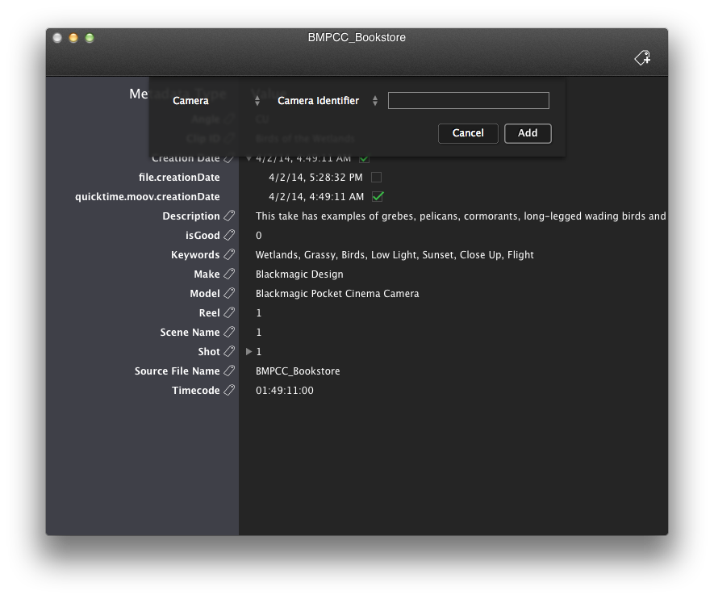

Keys that already exist in your file will be disabled from the "add metadata" screen.

## Removing Metadata ##

To remove a metadata entry, click the minus sign to the right of the entry.

## Global Metadata ##

EditReady allows you to set metadata across a set of files with a single operation.  From the Metadata menu, select either "Set Metadata for All" or "Set Metadata For Flagged."  Select a category and metadata key, and then enter a value.  This value will be set across all of the target files, and will replace any existing values for that key.

# Joining Files #

There are a number of ways in which EditReady can join media, depending on the type of source you're working with.

## Manually Joining Files ##

To manually join files, select the files you wish to join within EditReady, and then select "join" from the "clip" menu.  You may also split joins using the "split" command in that menu.

EditReady will only allow you to join media if the files all have the same frame size and framerate.  If there's a mismatch, the join menu option will be disabled.

## GoPro ##

EditReady will automatically join files that follow the standard GoPro naming conventions. 

## AVCHD and HDV ##

AVCHD and HDV cameras and direct to disk recorders automatically split long recordings across multiple files.  This split happens at a low level, so the files need to be recombined *before* they're converted.  If you add the root AVCHD folder from a card, or a set of HDV files with a known naming scheme, EditReady will automatically join them.

If you only have the MTS files, without the rest of the card metadata, you may still manually join the files (see above).  EditReady will attempt to detect whether the files are from a consecutive group, and will take the appropriate action to join them.

## MXF Files ##

Most cameras that work with the MXF format do not have limited file sizes.  However, some Canon cameras do split long recordings across multiple files.  In these cases, EditReady will attempt to automatically join the files.

# Naming Your Files #

EditReady includes powerful file naming features, so that you can keep track of all the files in your post production pipeline.

The popup menu to the right of the "Dest File Name" label is pre-populated with a handful of options.  You may, for example, choose to have your output file names match the input file names, or have them be named with an automatically incrementing number.

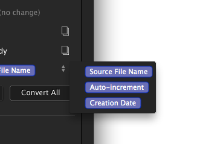

## Customizing File Names ##

In addition to the presets, you can add additional values from your file's metadata to the file naming scheme.  When viewing your file's metadata (see the [previous chapter](#browsing-metadata)), you will notice a small "tag" icon next to each metadata key.

Drag that tag to the "dest file name" field to include that metadata element in the destination filename.

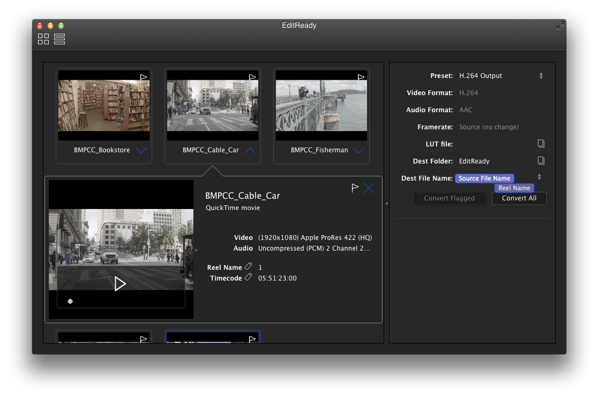

For example, you may wish to add the "Reel" key and the "Creation date" keys to the existing "auto-increment" entry.  You can drag and drop to rearrange values within the "dest file name" field, and you can type to add characters like dashes or underscores.  So, you could easily have all of your output files named "(Reel)-(CreationDate)-(Auto-increment).mov".

\break

## Overwriting Existing Files ##

EditReady will not allow you to proceed if your destination files will overwrite your source files.  In other cases where files will be overwritten, or where there is insufficient metadata to populate a filename, EditReady will alert you and allow you to continue.

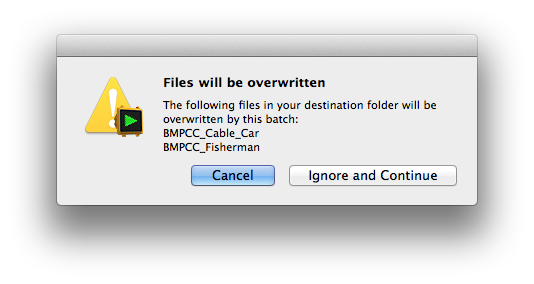

# Custom Presets

EditReady is an integral part of a post production workflow. To make the usage even more seamless, you can create custom presets that match your workflow needs.  Begin by selecting the "custom" preset in the preset dropdown.

## Video Format ##

EditReady allows you convert to Apple ProRes, Avid DNxHD and H.264.  You may also choose to pass the input video directly to the output file (using the "passthrough" option).  This is helpful if you only need to adjust the audio track or metadata of your file.

### Apple ProRes ###

Apple ProRes is a popular editing format, whether you're working with Apple Final Cut Pro X, Avid Media Composer 7, Adobe Premiere Pro CC, or apps like Blackmagic Design Resolve.

EditReady allows you choose from five different ProRes options - ProRes 422, 422 HQ, 422 LT, 422 Proxy, and 4444.  The "right" choice will be different for each workflow, but in general if your source is already compressed (an h264 file from a GoPro camera for example), the standard ProRes 422 file will be fine.

### Avid DNxHD ###

DNxHD is a popular editing format for workflows involving the Avid ecosystem.  EditReady provides three DNxHD choices, Low, Medium, and High.

These choices may be confusing if you're used to seeing DNxHD listed with a variety of bitrates.  EditReady selects the correct bitrate automatically, based on your input file's resolution and framerate.

For example, if your source is 1920x1080i60, the Low, Medium, and High settings correspond to DNxHD 100, 145 and 220, respectively.  For a 1920x1080p24 file, the bitrates are 36, 80 and 176.

If you'd like to see a full chart of the bitrates used by DNxHD, take a look at the [DNxHD whitepaper](http://www.avid.com/static/resources/US/documents/dnxhd.pdf) from Avid.

### H.264 ###

If you'd like to use EditReady for generating files for distribution, or for creating very small proxy files, the H.264 setting is a good option.  This setting will automatically select a bitrate high enough to preserve the quality of your source footage without introducing substantial artifacts.

## Audio Formats ##

EditReady includes three options for audio formats - Uncompressed, AAC, and Passthrough.  Passthrough will preserve your source audio and is useful if you only wish to make changes to the video component or metadata of your file.

### Uncompressed (PCM) ###

Uncompressed PCM audio is the most common and interoperable method for working with audio on a computer.  This is the recommended option for any editing platform.

### AAC ###

AAC compressed audio is an ideal choice if you'll be creating H.264 compressed files for distribution.

### None ###

Remove the audio entirely.

# Additional Batch Options #

EditReady provides a set of additional adjustments that can be added to your batch.  These are available via "Show Additional Options" which can be found in the Batch menu.  Each library entry has a set of adjustments, and is saved as part of your presets.

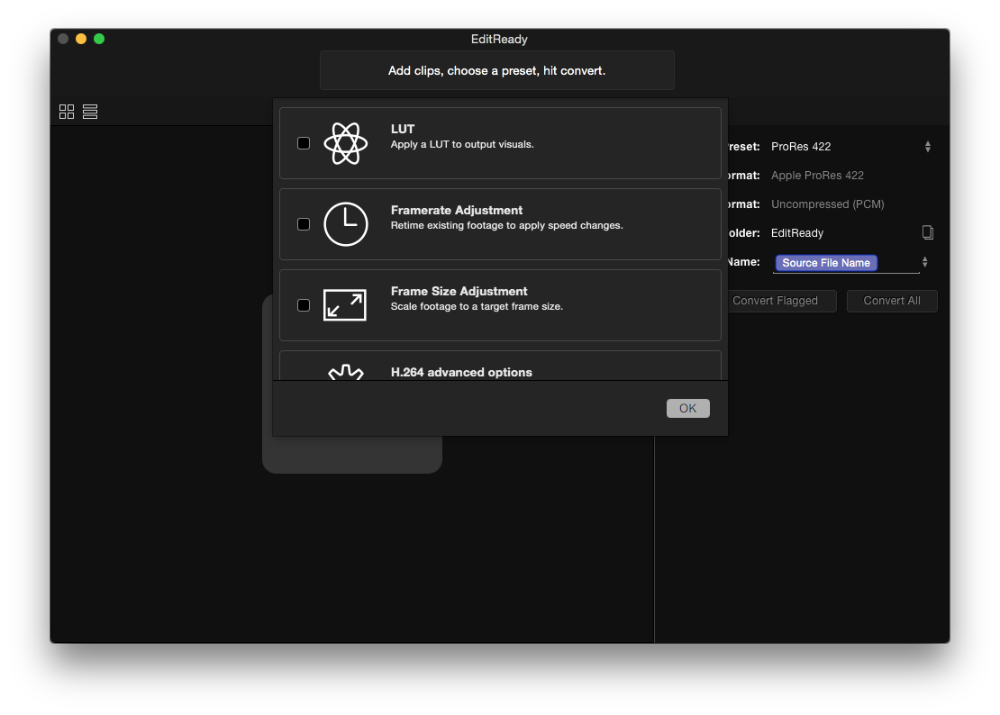

## Framerate Adjustment ##

EditReady allows you to adjust the output framerate of your file during conversion.  This is sometimes called conforming.  **This setting adjusts the playback rate of your media**, it does not add or remove frames from your footage.  This setting is especially useful when creating "slow motion" footage with a source that shoots at 60 or 120 frames per second (or higher). Framerate adjustment is not available when using "passthrough" settings.

## LUTs ##

EditReady allows you to load LUTs ("Look up Table") which can apply color grading looks to your footage during conversion.  This can be very powerful if, for example, your camera records in the log space, but you wish to edit with a linear mapping.  EditReady supports LUTs in the 3DL and Cube formats.  If you attempt to load a LUT in an unsupported format, EditReady will prompt you to submit the file to Divergent Media, so we can evaluate adding support for that format in the future.

If you save a new preset with a LUT, that LUT will be included in the preset.

Please note, LUTs require additional processing, and will slow the conversion process.

## Frame Size Adjustment ##

This option allows you to resize your source media to match a destination size.  Three scaling options are provided.

### Source Aspect ###

Maintain the aspect ratio of the source clip, and fit it within the target size.  For example, a 4096x2160 source clip with a 1920x1080 target size would be scaled to 1920x1012 in order to maintain the aspect ratio.

### Destination Size (pad) ###

Add padding (black bars) to fit the scaled source within the target size.  A 4096x2160 source with a 1920x1080 target would have small black bars at the top and bottom.

### Destination Size (stretch) ###

Stretch the source to fit the target size, regardless of the aspect ratio.

## H.264 Options ##

This entry is specifically for presets that use the H.264 codec.  By default, EditReady does a high quality H.264 encode which aims to preserve the image quality of your source.  This setting allows you to adjust a variety of H.264 parameters.  These settings will be disabled if your destination codec is something other than H.264.

### Target Bitrate ###

This will instruct EditReady to aim for this bitrate as an average for the file.  The automatic setting will adjust automatically to maintain a high quality image.

### Keyframes ###

This is a control for the number of keyframes (I-frames) per second in the output stream.  

### Profile ###

H.264 has a wide variety of profiles for encoding.  EditReady will choose the appropriate sub-profile based on the bitrate, keyframe, entropy coding, and resolution settings.

### Entropy ###

H.264 provides two types of entropy coding.  In general, CABAC is more efficient, but may require additional CPU power for playback and may not be supported on old devices.  In those cases, you may wish you use the CAVLAC setting.

# Troubleshooting

There are a few basic steps you can take when troubleshooting problems with EditReady.

## Errors during Conversion##

Some issues may be caused by invalid output destinations.  To test whether this is the case, try setting the "dest folder" option to your desktop.

### QuickTime (MOV, MP4, M4V) files ###

Does your file play within QuickTime player?  If QuickTime player reports that the file is unplayable, EditReady is unlikely to be able to convert it.  If QuickTime reports that you need additional components to play the file, you should download and install those to resolve the issue.

### MXF, HDV (M2T), and AVCHD (MTS) Files ###

You can test whether your MXF or AVCHD/HDV (MTS/M2T) file is valid by trying to play it with the free VLC player, from [www.videolan.org](http://www.videolan.org).  If the file plays in VLC but won't open or convert in EditReady, please [contact support](mailto:support@divergentmedia.com).

## Submitting File Diagnostics ##

If you'd like additional help with a problematic file, you may submit some file diagnostics to Divergent Media.  Highlight a file (or multiple files) within the EditReady interface, and then select "submit selected" from the Help menu.  You'll be prompted to supply a brief explanation of the issue, as well as your email address.  This process submits the file header and additional diagnostic data, but does not send us the actual video content of your file.

We'll contact you via email after we investigate.

# Other Resources #

If you need additional support using EditReady, please try the resources listed below.

## Support on the Web ##

<http://www.divergentmedia.com/support>

## Email support ##
<support@divergentmedia.com>

## Phone Support ##

888-632-0904

# Appendix A #

## Editing Metadata Options ##

If you're comfortable with the JSON format, you can customize the metadata keys EditReady presents in the "Add metadata" screen.  To access this file, control-click on EditReady in Finder and select "Show Package Contents," then browse to the Contents/Resources folder.  The metadataLookup.json file controls all of the values presented within EditReady.  We recommend using a JSON-validation tool when making changes - invalid JSON files may cause glitches or other issues in the application.

## Running EditReady on Mac OS X 10.8 (Mountain Lion) ##

EditReady 1.0.3 and later supports running on Mac OS X 10.8 Mountain Lion.  There are a few caveats when running on this version of the OS.  Hardware accelerated H.264 encode/decode is not available on Mac OS X 10.8.  Additionally, 10.8 doesn't include the Maps application, so location pins from GPS metadata will not display on a map.

## Command Line Interface ##

EditReady can be automated via its command line interface.  For an explanation of the command line options, you can run the following command from Terminal (assuming EditReady is in your Applications folder):

`/Applications/EditReady.app/Contents/MacOS/EditReady -help`

# Appendix B #

EditReady makes use of libraries from the [FFmpeg Project](http://ffmpeg.org) under the LGPLv2.1.  [Download the FFmpeg source code](https://github.com/FFmpeg/FFmpeg/commit/f406bf3fa933be089bd76a95f75ea57b0942f8c5).
